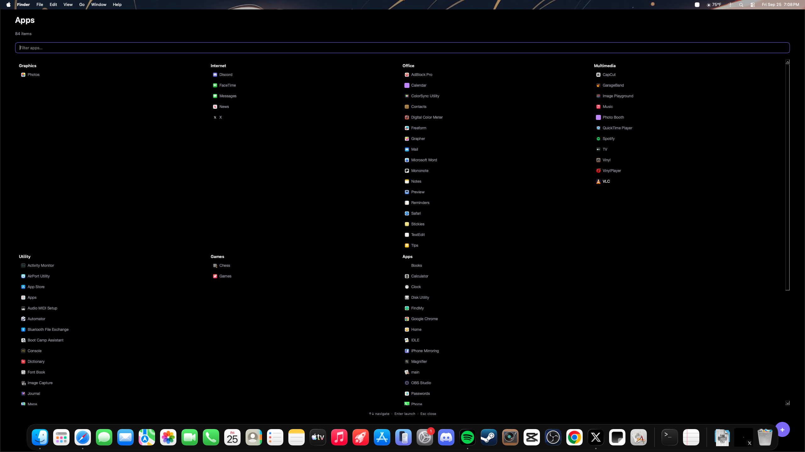

# Min Launcher — macOS port


A fullscreen, keyboard-driven app launcher for macOS (tested against macOS 26
"Tahoe"), ported from the original [min-launcher](https://github.com/maiosx/min-launcher)
Omarchy/Quickshell plugin.

## Why a rewrite instead of a "port" of the .qml files

The original plugin isn't just QML — it's built on **Quickshell**, which relies
on Wayland-specific pieces (`Quickshell.Wayland`, `PanelWindow`, layer-shell
surfaces) and on Omarchy's `AppLibrary` component for enumerating
`.desktop` files. None of that exists on macOS: there's no Wayland compositor,
no layer-shell protocol, and no `.desktop`/freedesktop category system.

So this port keeps the **design and behavior** (fullscreen dark grid grouped
by category, live search, arrow-key navigation, pinned Web Apps section) but
reimplements it as a standalone **PyQt6** application that:

- Scans `/Applications`, `/System/Applications`, `/System/Applications/Utilities`,
  and `~/Applications` for `.app` bundles instead of `.desktop` files.
- Reads each app's `Info.plist` for its display name and its
  `LSApplicationCategoryType` (Apple's equivalent of freedesktop categories),
  mapped to the same section names as the original (Development, Graphics,
  Internet, Office, Multimedia, Utility, Games, Apps).
- Extracts each app's icon via `sips` (built into macOS) instead of Quickshell's
  `AppLibrary.iconSource`.
- Launches apps with `open <path>` instead of `gtk-launch`.
- Stores Web Apps at `~/Library/Application Support/MinLauncher/web-apps.json`
  instead of `~/.config/omarchy/min-launcher-web-apps.json`.
- Toggles via a menu-bar icon and a global hotkey (`pynput`) instead of a
  Hyprland keybind + `omarchy-shell shell toggle`.

## Install & run (replace XXXXX with your username)

```bash
cd /Users/XXXXX/Downloads/min-launcher-macos-main
python3 -m venv .venv && source .venv/bin/activate
pip install -r requirements.txt
python3 main.py
```
If installation of PyQt6 or other dependencies fail for some reason run the following command
```bash
pip3 install PyQt6 pyobjc-framework-Cocoa pynput
```

A small icon appears in the menu bar. Click it (or press **Option+Space**) to
open the fullscreen launcher. Type to filter, **↑/↓** or **Tab** to move the
selection, **Enter** to launch, **Esc** to clear the filter / close.

### Global hotkey permissions

macOS requires **Accessibility** permission for any app that listens to
system-wide keystrokes (this is what `pynput` uses). The first time you press
the hotkey, macOS should prompt you; if it doesn't, add your terminal (or the
packaged app, see below) under:

**System Settings → Privacy & Security → Accessibility**

If you'd rather not grant that, skip the hotkey and just click the menu-bar
icon — everything else works without it.

### Changing the hotkey

Edit `GLOBAL_HOTKEY` near the top of `main.py`. It uses `pynput`'s syntax,
e.g. `"<cmd>+<shift>+m"`. Avoid combinations already owned by macOS (like
`Cmd+Space`, which is Spotlight).

## Packaging as a real .app (optional)

To get a double-clickable app, a proper menu-bar icon, and a `LSUIElement`
entry (so it never shows a Dock icon, no PyObjC workaround needed) build it
with [`py2app`](https://py2app.readthedocs.io/):

```bash
pip3 install py2app
py2applet --make-setup main.py
python3 setup.py py2app
```

Then add `LSUIElement: True` to the generated `Info.plist` in
`dist/main.app/Contents/`.

## Auto-start at login

Create `~/Library/LaunchAgents/com.min-launcher.plist`:

```xml
<?xml version="1.0" encoding="UTF-8"?>
<!DOCTYPE plist PUBLIC "-//Apple//DTD PLIST 1.0//EN"
 "http://www.apple.com/DTDs/PropertyList-1.0.dtd">
<plist version="1.0">
<dict>
    <key>Label</key><string>com.min-launcher</string>
    <key>ProgramArguments</key>
    <array>
        <string>/path/to/.venv/bin/python3</string>
        <string>/path/to/min-launcher-macos/main.py</string>
    </array>
    <key>RunAtLoad</key><true/>
</dict>
</plist>
```

Load it with `launchctl load ~/Library/LaunchAgents/com.min-launcher.plist`.

## Known limitations vs. the original

- No live-reload when apps are installed/removed while the launcher is open —
  it rescans each time you open it, which is fast enough in practice.
- Category mapping depends on the app declaring `LSApplicationCategoryType` in
  its `Info.plist`; apps that omit it land in the generic "Apps" section
  (same fallback behavior as the original).
- The floating "+" add-web-app button and category grid are recreated in
  PyQt6 widgets rather than QML, so spacing/animation is simpler — easy to
  restyle in `main.py` if you want closer visual parity.

## Structure

```
main.py            App scanning, filtering/grouping, and the PyQt6 UI
requirements.txt   PyQt6, pyobjc-framework-Cocoa, pynput
README.md          This file
```
